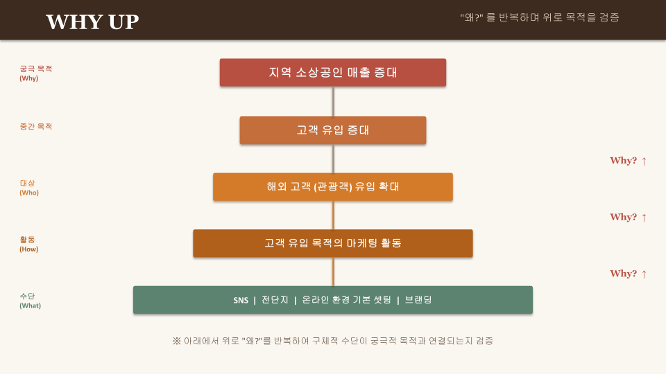

# WHY Tree: GlocalX (도출 과정 아카이브)

> **내부 보관용 — 제출 대상 아님.**
> 공식 제출본: [`docs/WHYTREE.md`](../docs/WHYTREE.md)

> **2026-04-07 스냅샷**
> 작업 캔버스: [Google Slides](https://docs.google.com/presentation/d/1zBm7PjXDZDwU_0oT4J0spxcBD0ifmWeKUGXMplyrKpo/edit?usp=drive_link)
> 작성: 정윤지·이승원의 독립 작업을 통일 트리로 통합

이 문서는 통일 트리의 도출 배경, 원본 작업물, 팀 내부 합의 과정을 보존하기 위한 아카이브다.
공식 제출 문서에는 결론과 다이어그램만 포함되며, 도출 과정은 본 파일에만 남는다.

---

## 도출 과정

이 결론은 두 사람의 독립 작업이 동일 지점으로 수렴한 결과다.

- **정윤지**는 "지역 경제 활성화 → … → 구글 프로필 관리"로 내려가는 종합 트리에서 Main / Out of Scope를 명시하고, **매출 극대화가 두 상위 목적(소상공인 지원 + 관광객 유치) 모두에 기여**한다는 M:N 관계를 그렸다.
- **이승원**은 같은 질문을 HOW DOWN("어떻게?" 위→아래)과 WHY UP("왜?" 아래→위) 양방향으로 검증해, "온라인 환경 기본 셋팅 = 우리 솔루션의 핵심 영역"이라는 동일한 결론에 도달했다.

두 접근법이 같은 결론에 수렴했다는 사실 자체가 우리 scope 결정의 1차 검증이다.

통일 트리에서는 두 분 작업의 통찰을 보존하면서, **GBP 자동화 → 마케팅비 절감**이라는 두 번째 M:N(점선 화살표)을 추가했다. 이것은 우리 사업 가치 제안의 핵심 — *"매출도 늘리고 비용도 줄인다"* — 을 한 다이어그램에 담기 위한 확장이다.

---

## 원본 작업물

### 정윤지: 종합 트리

Main / Sub / Out of Scope를 명시적으로 구분한 종합 view. 화살표가 두 갈래로 갈라지는 부분(매출 극대화 → 소상공인 지원 + 관광객 유치)이 통일 트리의 M:N #1의 출처이다.

### 이승원: HOW DOWN

"어떻게?"를 반복하며 위에서 아래로 구체화. 우리 솔루션의 핵심 영역이 "온라인 환경 기본 셋팅"임을 명시.

### 이승원: WHY UP

"왜?"를 반복하며 아래에서 위로 궁극 목적과 연결되는지 검증. 5단 사다리 (Why → 중간 목적 → Who → How → What).

---

## MANIFEST와의 연결

이 결론은 [`docs/MANIFEST.md`](../docs/MANIFEST.md)의 다음 원칙들을 직접 뒷받침한다.

- **"좁고 깊게: 부산 + 한국 음식 + 외국인 관광객"** — 통일 트리의 우리 영역(노란 박스)과 일치
- **"우리가 하지 않는 것 — 글로벌 SaaS 흉내"** — Out of Scope에 SNS/전단지/브랜딩이 들어간 결정과 일치
- **"북극성 지표는 외국인 길찾기 클릭"** — 다이어그램의 핵심 흐름(외국인 → GBP → 매출)과 일치
- **The Three Conditions** 중 "효과(외국인의 길찾기 클릭이 늘어남)"의 인과 사슬이 이 트리로 시각화됨

---

## 내부 노트

- 본 아카이브는 팀 내부 참고용. 외부 평가/제출 대상이 아님.
- Google Slides 캔버스가 추후 업데이트되어도 본 파일은 자동 동기화되지 않음 (수동 갱신 필요).
- 향후 사고 흐름이 바뀌면 본 파일과 공식 `docs/WHYTREE.md`를 모두 업데이트할 것.
