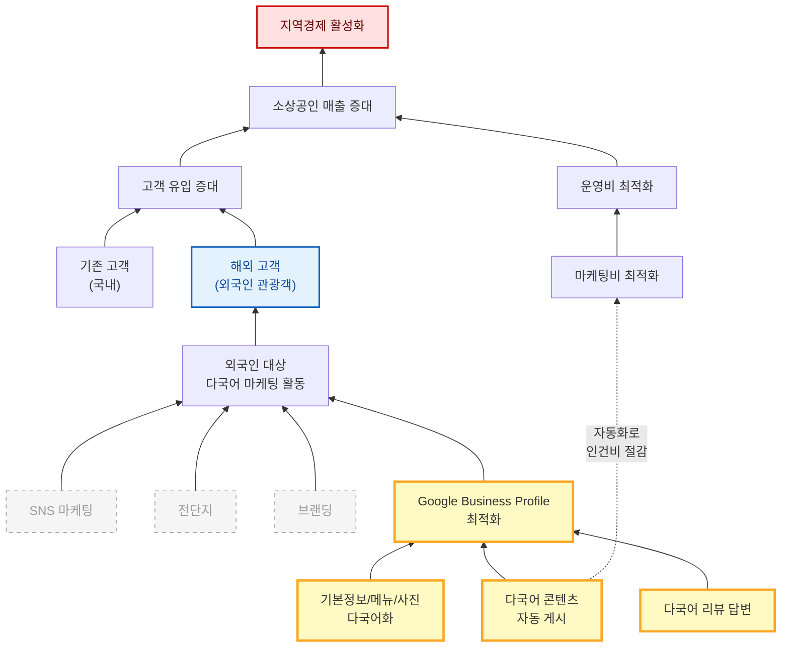

# WHY Tree: GlocalX

> **2026-04-07 스냅샷**
> 작업 캔버스: [Google Slides](https://docs.google.com/presentation/d/1zBm7PjXDZDwU_0oT4J0spxcBD0ifmWeKUGXMplyrKpo/edit?usp=drive_link)
> 작성: 정윤지·이승원의 독립 작업을 통일 트리로 통합

---

## 우리 팀의 결론

우리는 외국인 관광객의 Google Business Profile 도달을 자동화한다. 이것이 매출 증대와 운영비 절감 두 목표에 동시에 기여하는 유일한 영역이다.

---

## 다이어그램

---

## 다이어그램 읽는 법

| 시각 표시 | 의미 |
|-----------|------|
| 빨간 박스 (위) | 궁극 목적 — 우리가 서비스를 통해 이루고자 하는 가치 |
| 파란 박스 | 우리 타겝 — 외국인 관광객 |
| 노란 굵은 박스 | 우리 영역 — Google Business Profile 최적화 + 3가지 수단 |
| 회색 점선 박스 | Out of Scope — SNS 마케팅, 전단지, 브랜딩 |
| 점선 화살표 (Sol1 → Mkc) | GBP 자동화는 외국인 유입(매출)뿐 아니라 인건비 절감(운영비)에도 기여 (M:N) |

---

## Scope 결정

| 분류 | 항목 | 이유 |
|------|------|------|
| In Scope (Main) | GBP 다국어 콘텐츠 자동 생성/게시 | 자동화 가능, 외국인 도달 직접 효과 |
| In Scope (Main) | 기본정보/메뉴/사진 다국어화 | 1회성 작업, 지속 효과 |
| In Scope (Main) | 다국어 리뷰 답변 | 검색 순위 영향 (2026.03 코어 알고리즘 업데이트) |
| Out of Scope | SNS 마케팅 | 별도 플랫폼/인력 필요, 채널 분산 위험 |
| Out of Scope | 전단지/오프라인 광고 | 외국인 도달률 낮음, 측정 어려움 |
| Out of Scope | 브랜딩 | 장기적, 자원 집중도 높음 |
| Out of Scope | 객단가 상승, 식음료 품질 | 매장 운영 영역, 우리 통제 밖 |

---

## 마케팅 전략 디테일 (이승원)

### 1. 왜 GBP인가 — 시장 격차 분석

외국인 관광객은 한국 도착 전부터 Google Maps로 음식점을 검색한다. 네이버 지도나 카카오맵은 한국어 UI 중심이라 외국인이 사실상 사용하지 않는다.

그런데 부산 소상공인의 GBP 현실은 다음과 같다.

- 대부분 GBP 프로필 자체가 없거나 방치 상태
- 등록되어 있어도 상호명·메뉴가 한국어로만 되어 있음
- 영업시간·휴무일 정보가 실제와 불일치
- 외국인 리뷰에 응답하지 욊음

이 격차가 곧 우리의 기회다. 외국인은 검색하고 싶고, 점주는 노출되고 싶지만, 둘 사이를 연결하는 다국어 인프라가 없다. GlocalX는 이 빈 자리를 채운다.

### 2. 외국인 관광객의 음식점 탐색 경로

실제 외국인 관광객이 부산에서 밥집을 찾는 과정은 아래와 같다.

1. **사전 검색** (출국 전 또는 숙소에서): "best Korean BBQ in Busan", "Busan seafood restaurant" 등 Google 검색
2. **지도 탐색**: Google Maps에서 현재 위치 기반 "restaurants near me" 검색
3. **프로필 비교**: 별점, 리뷰 수, 사진, 메뉴 정보를 보고 2~3곳 후보 선정
4. **최종 결정**: 길찾기(Directions) 클릭 → 도보 또는 택시로 이동
5. **방문 후**: Google 리뷰 작성, 사진 업로드

이 경로에서 1~4단계 전체가 GBP 위에서 일어난다. GBP 프로필 품질이 곧 매출이다.

### 3. GlocalX가 개입하는 지점

- **인지 단계**: 외국인이 실제로 사용하는 검색 키워드로 GBP 최적화
  - 예: "부산 돼지국밥" → "Busan pork rice soup", "豚クッパ 釜山", "釜山猪肉汤饭"
  - 영어·일본어·중국어 3개 국어 동시 대응
  - 카테고리 태그, 속성(Attributes) 정홑하게 설정

- **관심 단계**: 프로필을 클릭한 외국인이 이탈하지 않도록 정보 보강
  - 메뉴 이름 + 간단한 설명을 다국어로 자동 번역
  - 가게 소개(Business Description) 다국어 작성
  - 대표 사진과 메뉴 사진 업로드 가이드 제공

- **결정 단계**: 길찾기 클릭으로 이어지도록 정확한 정보 유지
  - 영업시간·휴무일 자동 동기화 (명절, 임시 휴무 포함)
  - 정확한 주소·입구 위치 핀 설정
  - 전화번호, 가격대 정보 정비

- **방문 이후** (추후 확장): 외국인 리뷰에 다국어 자동 응답

### 4. 이중 가치 구조 — 매출 증가 + 비용 절감

WHY Tree의 M:N 관계에서 도출한 GlocalX의 핵심 가치 제안은 두 가지다.

**가치 1: 매출 증가**
- 다국어 GBP 최적화 → Google Maps 검색 노출 순위 상승
- 노출 증가 → 프로필 조회 증가 → 길찾기 클릭 증가 → 실제 방문·매출 상승
- 외국인 관광객은 객단가가 높고 (관광지 소비 특성), 리뷰를 남겨 추가 유입을 만든다

**가치 2: 마케팅비 절감**
- 기존 소상공인 마케팅: 전단지 인쇄, 배달앱 수수료, SNS 광고비 등 월 수숭만 원 지출
- GBP 자동화는 이 비용을 대체한다: 한 번 세팅하면 지속적으로 검색 유입이 발생
- 점주가 직접 번역·관리할 필요 없음 → 시간 비용도 절감

요약하면: **"매출은 올리고 비용은 줄인다."** 이것이 점주에게 전달할 핵시 메시지다.

### 5. 타겝 세그먼트

**1차 타겟 점주**
- 부산 서면·해운대·광안리·남포동 핵심 관광 상권
- 한식당 (고기구이, 해산물, 국밥, 분식 등)
- GBP 미등록이거나 한국어만 등록된 가게

**1차 타겟 관광객**
- 영어권 개별 여행자 (FIT: Free Independent Traveler)
- 20~40대, 스마트폰으로 직접 검색하는 층

**확장 타겝**
- 일본·중국·동남아 관광객 (언어 추가)
- 카페·디저트·술집 등 업종 확장
- 뵠산 외 관광 도시 (서울, 제주 등)

### 6. 핵심 지표 (KPI)

**북극성 지표: 외국인 길찾기 클릭 수**

이 지표를 선택한 이유: 길찾기 클릭은 "이 가게에 갈 의향이 있다"는 가장 강한 행동 신호이며, GBP Insights에서 직접 측정 가능하다.

**보조 지표**
- GBP 검색 노출 수: 우리 최적화가 실제로 검색에 반영되는지 확인
- 프로필 조회 수: 노출 → 클릭 전환율 측정
- 다국어 커버리지율: 등록된 가게의 메뉴·소개 중 3개 국어 번역 완료 비율
- 리뷰 응답률: (추후 확장) 외국인 리뷰 대비 자동 응답 비율

**PoC 목표**
- 파일럿 가게 GBP 노출 수 30% 증가
- 길찾기 클릭 수 20% 증가
- 메뉴 항목 100% 다국어 번역 완료

### 7. 경쟁 환경과 차별점

현재 뵠산에서 외국인 대상 음식점 마케팅을 전문으로 하는 서비스는 사실상 없다.

- **기존 마케팅 대행사**: SNS 운영, 블로그 포스팅 중심 → 한국인 대상, 외국인 미고려
- **번역 서비스**: 단발성 번역만 제공 → 지속적 GBP 관리 불가
- **배달앱**: 배달 중심, 외국인 관광객의 방문 식사와 무관
- **관광공사/지자체**: 일반적 관광 홍보 → 개별 음식점 단위 지원 없음

GlocalX의 차별점: **개별 음식점 단위의 GBP 다국어 자동화**를 하는 곳이 없다. 이 틈새가 우리 포지션이다.

### 8. 우리가 하지 않는 것 (Out of Scope)

- SNS 마케팅 (인스타그램, 틱톡, 유튜브 등)
- 전단지·현수막 등 오프라인 광고
- 브랜딩·로고·인테리어 컨설팅
- 글로벌 SaaS 플랫폼 구축
- 배달앱 입점·관리
- 한국인 대상 마케팅

범위를 좁히는 이유: 리소스가 한정된 팀이 여러 채널에 분산되면 어디서도 성과를 내지 못한다. GBP 하나에 집중해서 확실한 결과를 먼저 만든다.

---

## 도출 과정

이 결론은 두 사람의 독립 작업이 동일 지점으로 수렴한 결과다.

- **정윤지**는 "지역 경제 활성화 → … → 구글 프로필 관리"로 내려가는 종합 트리에서 Main / Out of Scope를 명시하고, **매출 극대화가 두 상위 목적(소상공인 지원 + 관광객 유치) 모두에 기여**한다는 M:N 관계를 그렸다.
- **이승원**은 같은 질문을 HOW DOWN("어떻게?" 위→아래)과 WHY UP("왜?" 아래→위) 양방향으로 검증해, "온라인 환경 기본 셋팅 = 우리 솔루션의 핵심 영역"이라는 동일한 결론에 도달했다.

두 접근법이 같은 결론에 수렴했다는 사실 자체가 우리 scope 결정의 1차 검증이다.

통일 트리에서는 두 분 작업의 통찰을 보존하면서, **GBP 자동화 → 마케팅비 절감**이라는 두 번째 M:N(점선 화살표)을 추가했다. 이것은 우리 사업 가치 제안의 핵쌬 — *"매출도 늘리고 비용도 줄인다"* — 을 한 다이어그램에 담기 위한 확장이다.

---

## 원본 작업물

### 정윤지: 종합 트리

Main / Sub / Out of Scope를 명시적으로 구분한 종합 view. 화살표가 두 갈래로 갈라지는 부분(매출 극대화 → 소상공인 지원 + 관광객 유치)등 M:N 관계를 분석.

### 이승원: HOW DOWN

"어떻게?"를 반복하며 위에서 아래로 구체화. 우리 솔루션의 핵심 영역이 "온라인 환경 기본 셋팅"임을 명시.

### 이승원: WHY UP

"왜?"를 반복하며 아래에서 위로 궁극 목적과 연결되는지 검증. 5단 사다리 (Why → 중간 목적 → Who → How → What).

---

## MANIFEST와의 연결

이 결론은 [`MANIFEST.md`](./MANIFEST.md)의 다음 원칙들을 직접 뒷받침한다.

- **"좁고 깊게: 부산 + 한국 음식 + 외국인 관광객"** — 통일 트리의 우리 영역(노란 박스)과 일치
- **"우리가 하지 않는 것 — 글로벌 SaaS 흉내"** — Out of Scope에 SNS/전단지/브랜딩이 들어간 결정과 일치
- **"북극성 지표는 외국인 길찾기 클릭"** — 다이어그램의 핵심 흐름(외국인 → GBP → 매출)과 일치
- **The Three Conditions** 중 "효과(외국인의 길찾기 클릭이 늘어남)"의 인과 사숬이 이 트리로 시각화됨

원칙은 [`MANIFEST.md`](./MANIFEST.md) 참조.
