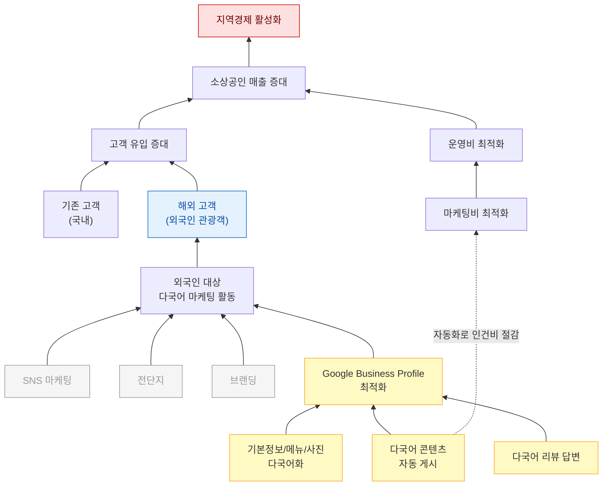
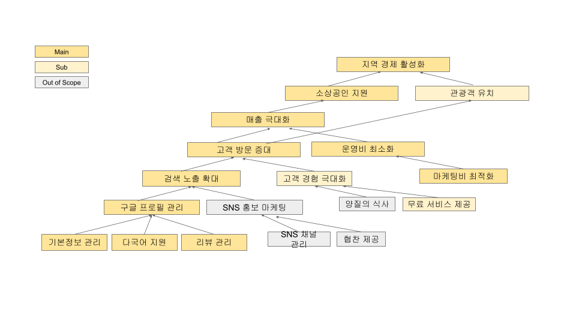
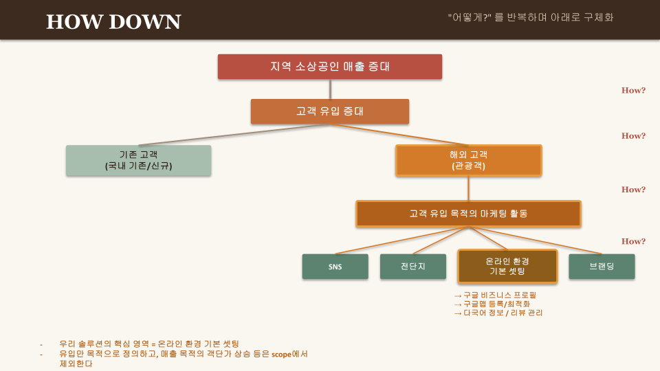

# WHY Tree: GlocalX

> **2026-04-08 스냅샷**  
> 작업 캔버스: [Google Slides](https://docs.google.com/presentation/d/1zBm7PjXDZDwU_0oT4J0spxcBD0ifmWeKUGXMplyrKpo/edit?usp=drive_link)  
> 작성: 정윤지·이승원의 독립 작업을 통일 트리로 통합

---

## 우리 팀의 결론

우리는 외국인 관광객의 Google Business Profile 도달을 자동화한다.  
이것이 매출 증대와 운영비 절감 두 목표에 동시에 기여하는 유일한 영역이다.

---

## 다이어그램

---

## 다이어그램 읽는 법

| 시각 표시 | 의미 |
|-----------|------|
| 빨간 박스 (위) | 궁극 목적 — 서비스를 통해 이루고자 하는 최상위 가치 |
| 파란 박스 | 우리 타겟 — 외국인 관광객 |
| 노란 굵은 박스 | 우리 영역 — Google Business Profile 최적화 + 3가지 수단 |
| 회색 점선 박스 | Out of Scope — SNS 마케팅, 전단지, 브랜딩 |
| 점선 화살표 (Sol1 → Mkc) | GBP 자동화는 외국인 유입(매출)뿐 아니라 인건비 절감(운영비)에도 기여 (M:N) |

---

## Scope 결정

| 분류 | 항목 | 이유 |
|------|------|------|
| In Scope (Main) | GBP 다국어 콘텐츠 자동 생성/게시 | 자동화 가능, 외국인 도달 직접 효과 |
| In Scope (Main) | 기본정보/메뉴/사진 다국어화 | 1회성 작업, 지속 효과 |
| In Scope (Main) | 다국어 리뷰 답변 | 검색 순위 영향 (2026.03 코어 알고리즘 업데이트) |
| Out of Scope | SNS 마케팅 | 별도 플랫폼/인력 필요, 채널 분산 위험 |
| Out of Scope | 전단지/오프라인 광고 | 외국인 도달률 낮음, 측정 어려움 |
| Out of Scope | 브랜딩 | 장기적, 자원 집중도 높음 |
| Out of Scope | 객단가 상승, 식음료 품질 | 매장 운영 영역, 우리 통제 밖 |

---

## 마케팅 전략 디테일

### 1. 왜 GBP인가 — 시장 격차 분석

외국인 관광객은 한국 도착 전부터 Google Maps로 음식점을 검색한다.  
네이버 지도·카카오맵은 한국어 UI 중심이라 외국인이 사실상 사용하지 않는다.

부산 소상공인의 GBP 현실:

- 대부분 GBP 프로필 자체가 없거나 방치 상태
- 등록되어 있어도 상호명·메뉴가 한국어로만 표기
- 영업시간·휴무일 정보가 실제와 불일치
- 외국인 리뷰에 응답하지 않음

외국인은 검색하고 싶고, 점주는 노출되고 싶지만, 둘 사이를 연결하는 다국어 인프라가 없다.  
**GlocalX는 이 빈 자리를 채운다.**

### 2. 외국인 관광객의 음식점 탐색 경로

1. **사전 검색** (출국 전 또는 숙소): "best Korean BBQ in Busan", "Busan seafood restaurant"
2. **지도 탐색**: Google Maps에서 현재 위치 기반 검색
3. **프로필 비교**: 별점·리뷰 수·사진·메뉴를 보고 2~3곳 후보 선정
4. **최종 결정**: 길찾기(Directions) 클릭 → 이동
5. **방문 후**: Google 리뷰 작성, 사진 업로드

1~4단계 전체가 GBP 위에서 일어난다. **GBP 프로필 품질이 곧 매출이다.**

### 3. GlocalX가 개입하는 지점

**인지 단계** — 외국인이 실제로 사용하는 키워드로 GBP 최적화

- 예: "부산 돼지국밥" → "Busan pork rice soup" / "豚クッパ 釜山" / "釜山猪肉汤饭"
- 영어·일본어·중국어 3개 국어 동시 대응
- 카테고리 태그, 속성(Attributes) 정확 설정

**관심 단계** — 프로필 진입 후 이탈 방지

- 메뉴 이름 + 설명 다국어 자동 번역
- 가게 소개(Business Description) 다국어 작성
- 대표 사진·메뉴 사진 업로드 가이드 제공

**결정 단계** — 길찾기 클릭으로 전환

- 영업시간·휴무일 자동 동기화 (명절, 임시 휴무 포함)
- 정확한 주소·입구 위치 핀 설정
- 전화번호, 가격대 정보 정비

**방문 이후** *(추후 확장)* — 외국인 리뷰 다국어 자동 응답

### 4. 이중 가치 구조 — 매출 증가 + 비용 절감

**가치 1: 매출 증가**  
다국어 GBP 최적화 → 검색 노출 증가 → 길찾기 클릭 증가 → 방문·매출 상승.  
외국인 관광객은 객단가가 높고, 리뷰를 남겨 추가 유입을 만든다.

**가치 2: 마케팅비 절감**  
전단지·SNS 광고·수작업 번역 대신 GBP 자동화.  
한 번 세팅하면 지속적으로 검색 유입이 발생하고, 점주의 시간 비용도 사라진다.

> **핵심 메시지: "매출은 올리고 비용은 줄인다."**

### 5. 타겟 세그먼트

**1차 타겟 점주**
- 부산 서면·해운대·광안리·남포동 핵심 관광 상권
- 한식당 (고기구이, 해산물, 국밥, 분식 등)
- GBP 미등록이거나 한국어만 등록된 가게

**1차 타겟 관광객**
- 영어권 개별 여행자 (FIT: Free Independent Traveler)
- 20~40대, 스마트폰으로 직접 검색하는 층

**확장 타겟**
- 일본·중국·동남아 관광객 (언어 추가)
- 카페·디저트·술집 등 업종 확장
- 부산 외 관광 도시 (서울, 제주 등)

### 6. 핵심 지표 (KPI)

**⭐ 북극성 지표: 외국인 길찾기 클릭 수**

길찾기 클릭은 "이 가게에 갈 의향이 있다"는 가장 강한 행동 신호이며,  
GBP Insights에서 직접 측정 가능하다.

| 지표 | 설명 |
|------|------|
| GBP 검색 노출 수 | 최적화가 실제 검색에 반영되는지 확인 |
| 프로필 조회 수 | 노출 → 클릭 전환율 측정 |
| 다국어 커버리지율 | 메뉴·소개의 3개 국어 번역 완료 비율 |
| 리뷰 응답률 | (추후 확장) 외국인 리뷰 대비 자동 응답 비율 |

**PoC 목표**
- GBP 노출 수 +30%
- 길찾기 클릭 수 +20%
- 메뉴 항목 100% 다국어 번역 완료

### 7. 경쟁 환경과 차별점

| 경쟁자 | 한계 |
|--------|------|
| 기존 마케팅 대행사 | SNS·블로그 중심, 한국인 대상, 외국인 미고려 |
| 번역 서비스 | 단발성 번역만 제공, 지속 GBP 관리 불가 |
| 배달앱 | 배달 중심, 외국인 방문 식사와 무관 |
| 관광공사/지자체 | 일반 홍보, 개별 음식점 단위 지원 없음 |

**GlocalX의 포지션**: 개별 음식점 단위의 GBP 다국어 자동화를 하는 곳이 없다. 이 틈새가 우리 자리다.

### 8. 우리가 하지 않는 것 (Out of Scope)

- SNS 마케팅 (인스타그램, 틱톡, 유튜브 등)
- 전단지·현수막 등 오프라인 광고
- 브랜딩·로고·인테리어 컨설팅
- 글로벌 SaaS 플랫폼 구축
- 배달앱 입점·관리
- 한국인 대상 마케팅

리소스가 한정된 팀이 여러 채널에 분산되면 어디서도 성과를 내지 못한다.  
GBP 하나에 집중해서 확실한 결과를 먼저 만든다.

---

## PREMORTEM — Marketing / Brand 리스크

### #3 경쟁 위협

**시나리오**: 구글이 GBP 다국어 자동번역을 네이티브로 출시하거나, 네이버·인스타 대행사가 GBP 시장에 진입한다.

**Impact**: Medium

**왜 Medium인가**  
단기 실현 가능성은 낮다. 구글의 자동번역은 이미 존재하지만 마케팅 콘텐츠 생성·포스팅 자동화와는 다른 영역이다. 대행사 진입은 구조적으로 느리다.

**대응 방안**  
GlocalX의 핵심은 번역이 아니라 **지속적 게시 자동화 + 한국 음식 카테고리 특화 콘텐츠**다.  
"국밥"을 "Rice Soup"으로 번역하는 게 아니라 "Hearty Busan-style hangover soup, a local staple since the 1950s"처럼 맥락화하는 것은 범용 번역이 대체할 수 없다.  
초기에 점주와의 관계 자산(리뷰 히스토리, 프로필 최적화 누적치)을 빠르게 쌓으면 후발 진입자가 뒤집기 어렵다.

### #4 마케팅 콘텐츠 전환 실패

**시나리오**: GBP 노출은 늘었는데 외국인이 실제로 방문하지 않는다. 길찾기 클릭이 발생하지 않거나, 클릭 이후 이탈한다.

**Impact**: High

**왜 High인가**  
북극성 지표(길찾기 클릭)가 움직이지 않으면 점주 설득이 불가능하고, 서비스 가치 증명 자체가 무너진다.

**대응 방안**  
실패 원인을 두 단계로 분리해 진단한다.

- **노출 → 클릭 실패**: 콘텐츠 문제. 외국인이 반응하는 키워드·사진 포맷을 PoC 기간 내 A/B 테스트로 검증한다. 외국인은 "현지인 리뷰"와 "최신 사진"을 기반으로 방문을 결정하므로, 사진 퀄리티와 업로드 주기가 핵심 변수다.
- **클릭 → 방문 실패**: 정보 정확도 문제. 영업시간·위치 불일치가 이탈을 만든다. 자동 동기화 정확도를 최우선으로 관리한다.

북극성 지표를 '노출 수'가 아닌 **'길찾기 클릭'으로 고정**한 것 자체가 안전망이다.  
노출이 늘어도 클릭이 없으면 실패로 인식하고 즉시 콘텐츠 전략을 수정한다.

---

## 도출 과정

- **정윤지**는 "지역 경제 활성화 → … → 구글 프로필 관리"로 내려가는 종합 트리에서 Main / Out of Scope를 명시하고, 매출 극대화가 두 상위 목적(소상공인 지원 + 관광객 유치) 모두에 기여한다는 M:N 관계를 그렸다.
- **이승원**은 같은 질문을 HOW DOWN("어떻게?" 위→아래)과 WHY UP("왜?" 아래→위) 양방향으로 검증해, "온라인 환경 기본 셋팅 = 우리 솔루션의 핵심 영역"이라는 동일한 결론에 도달했다.

두 접근법이 같은 결론에 수렴했다는 사실 자체가 scope 결정의 1차 검증이다.  
통일 트리에서는 두 작업의 통찰을 보존하면서, **GBP 자동화 → 마케팅비 절감**이라는 두 번째 M:N(점선 화살표)을 추가했다.

---

## 원본 작업물

### 정윤지: 종합 트리

### 이승원: HOW DOWN

### 이승원: WHY UP

---

## MANIFEST와의 연결

| MANIFEST 원칙 | 이 문서에서의 반영 |
|---------------|------------------|
| "좁고 깊게: 부산 + 한국 음식 + 외국인 관광객" | 통일 트리 노란 박스(우리 영역)와 일치 |
| "우리가 하지 않는 것 — 글로벌 SaaS 흉내" | Out of Scope에 SNS/전단지/브랜딩 포함 |
| "북극성 지표는 외국인 길찾기 클릭" | 다이어그램 핵심 흐름(외국인 → GBP → 매출)과 일치 |
| The Three Conditions 중 "효과" | 외국인 길찾기 클릭의 인과 사슬이 이 트리로 시각화됨 |

원칙은 [`MANIFEST.md`](./MANIFEST.md) 참조.
