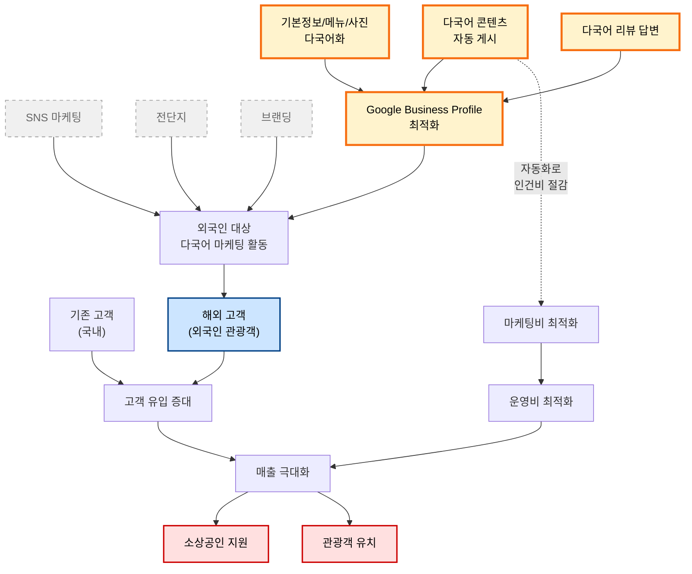

# WHY Tree: GlocalX

> **2026-04-07 스냅샷**
> 작업 캔버스: [Google Slides](https://docs.google.com/presentation/d/1zBm7PjXDZDwU_0oT4J0spxcBD0ifmWeKUGXMplyrKpo/edit?usp=drive_link)
> 작성: 정윤지·이승원의 독립 작업을 통일 트리로 통합

---

## 우리 팀의 결론

**우리는 외국인 관광객의 Google Business Profile 도달을 자동화한다.**
이것이 매출 증대와 운영비 절감 두 목표에 동시에 기여하는 유일한 영역이다.

### 다이어그램 읽는 법

| 시각 표시 | 의미 |
|---|---|
| **빨간 박스 (위)** | 궁극 목적 두 개 — 매출 극대화는 둘 모두에 기여 (M:N #1) |
| **파란 박스** | 우리 타겟 — 외국인 관광객 |
| **노란 굵은 박스** | 우리 영역 — Google Business Profile 최적화 + 3가지 수단 |
| **회색 점선 박스** | Out of Scope — SNS 마케팅, 전단지, 브랜딩 |
| **점선 화살표** (Sol1 → Mkc) | GBP 자동화는 외국인 유입(매출)뿐 아니라 인건비 절감(운영비)에도 기여 (M:N #2) |

### Scope 결정

| 분류 | 항목 | 이유 |
|---|---|---|
| **In Scope (Main)** | GBP 다국어 콘텐츠 자동 생성/게시 | 자동화 가능, 외국인 도달 직접 효과 |
| **In Scope (Main)** | 기본정보/메뉴/사진 다국어화 | 1회성 작업, 지속 효과 |
| **In Scope (Main)** | 다국어 리뷰 답변 | 검색 순위 영향 (2026.03 코어 알고리즘 업데이트) |
| Out of Scope | SNS 마케팅 | 별도 플랫폼/인력 필요, 채널 분산 위험 |
| Out of Scope | 전단지/오프라인 광고 | 외국인 도달률 낮음, 측정 어려움 |
| Out of Scope | 브랜딩 | 장기적, 자원 집중도 높음 |
| Out of Scope | 객단가 상승, 식음료 품질 | 매장 운영 영역, 우리 통제 밖 |

---

## 도출 과정

이 결론은 두 사람의 독립 작업이 동일 지점으로 수렴한 결과다.

- **정윤지**는 "지역 경제 활성화 → … → 구글 프로필 관리"로 내려가는 종합 트리에서 Main / Out of Scope를 명시하고, **매출 극대화가 두 상위 목적(소상공인 지원 + 관광객 유치) 모두에 기여**한다는 M:N 관계를 그렸다.
- **이승원**은 같은 질문을 HOW DOWN("어떻게?" 위→아래)과 WHY UP("왜?" 아래→위) 양방향으로 검증해, "온라인 환경 기본 셋팅 = 우리 솔루션의 핵심 영역"이라는 동일한 결론에 도달했다.

두 접근법이 같은 결론에 수렴했다는 사실 자체가 우리 scope 결정의 1차 검증이다.

통일 트리에서는 두 분 작업의 통찰을 보존하면서, **GBP 자동화 → 마케팅비 절감**이라는 두 번째 M:N(점선 화살표)을 추가했다. 이것은 우리 사업 가치 제안의 핵심 — *"매출도 늘리고 비용도 줄인다"* — 을 한 다이어그램에 담기 위한 확장이다.

---

## 원본 작업물

### 정윤지: 종합 트리

Main / Sub / Out of Scope를 명시적으로 구분한 종합 view. 화살표가 두 갈래로 갈라지는 부분(매출 극대화 → 소상공인 지원 + 관광객 유치)이 통일 트리의 M:N #1의 출처이다.

### 이승원: HOW DOWN

"어떻게?"를 반복하며 위에서 아래로 구체화. 우리 솔루션의 핵심 영역이 "온라인 환경 기본 셋팅"임을 명시.

### 이승원: WHY UP

"왜?"를 반복하며 아래에서 위로 궁극 목적과 연결되는지 검증. 5단 사다리 (Why → 중간 목적 → Who → How → What).

---

## MANIFEST와의 연결

이 결론은 [`MANIFEST.md`](./MANIFEST.md)의 다음 원칙들을 직접 뒷받침한다.

- **"좁고 깊게: 부산 + 한국 음식 + 외국인 관광객"** — 통일 트리의 우리 영역(노란 박스)과 일치
- **"우리가 하지 않는 것 — 글로벌 SaaS 흉내"** — Out of Scope에 SNS/전단지/브랜딩이 들어간 결정과 일치
- **"북극성 지표는 외국인 길찾기 클릭"** — 다이어그램의 핵심 흐름(외국인 → GBP → 매출)과 일치
- **The Three Conditions** 중 "효과(외국인의 길찾기 클릭이 늘어남)"의 인과 사슬이 이 트리로 시각화됨
