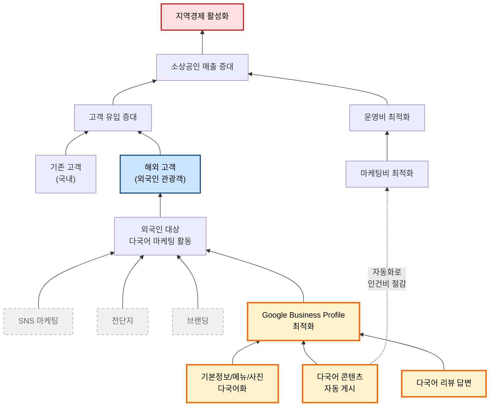

# WHY Tree: GlocalX

> 출처: [Google Slides](https://docs.google.com/presentation/d/1zBm7PjXDZDwU_0oT4J0spxcBD0ifmWeKUGXMplyrKpo/edit?usp=drive_link)

## 우리 팀의 결론

**우리는 외국인 관광객의 Google Business Profile 도달을 자동화한다.**
이것이 매출 증대와 운영비 절감 두 목표에 동시에 기여하는 유일한 영역이다.

### 다이어그램 읽는 법

| 시각 표시 | 의미 |
|---|---|
| **빨간 박스 (위)** | 궁극 목적 — 우리가 서비스를 통해 이루고자 하는 가치 |
| **파란 박스** | 우리 타겟 — 외국인 관광객 |
| **노란 굵은 박스** | 우리 영역 — Google Business Profile 최적화 + 3가지 수단 |
| **회색 점선 박스** | Out of Scope — SNS 마케팅, 전단지, 브랜딩 |
| **점선 화살표** (Sol1 → Mkc) | GBP 자동화는 외국인 유입(매출)뿐 아니라 인건비 절감(운영비)에도 기여 (M:N) |

### Scope 결정

| 분류 | 항목 | 이유 |
|---|---|---|
| **In Scope (Main)** | GBP 다국어 콘텐츠 자동 생성/게시 | 자동화 가능, 외국인 도달 직접 효과 |
| **In Scope (Main)** | 기본정보/메뉴/사진 다국어화 | 1회성 작업, 지속 효과 |
| **In Scope (Main)** | 다국어 리뷰 답변 | 검색 순위 영향 (2026.03 코어 알고리즘 업데이트) |
| Out of Scope | SNS 마케팅 | 별도 플랫폼/인력 필요, 채널 분산 위험 |
| Out of Scope | 전단지/오프라인 광고 | 외국인 도달률 낮음, 측정 어려움 |
| Out of Scope | 브랜딩 | 장기적, 자원 집중도 높음 |
| Out of Scope | 객단가 상승, 식음료 품질 | 매장 운영 영역, 우리 통제 밖 |

---

원칙은 [`MANIFEST.md`](./MANIFEST.md) 참조.
